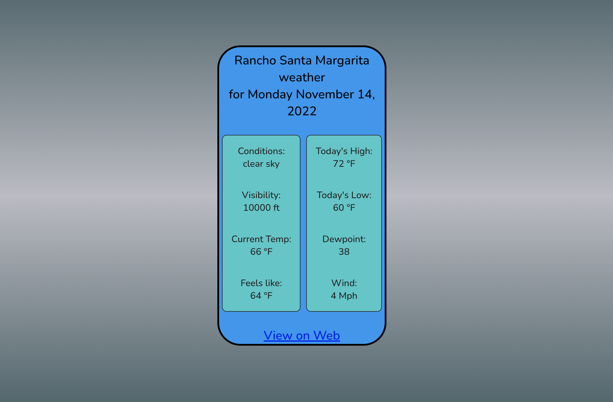

# WeatherApp!

Welcome to the web’s brand new lightweight weather app!



## Technology Used

This React app renders functional components, and uses hooks for state management. Props pass data back and forth. React was chosen for its lightning fast virtual dom, which re-renders only necessary elements, greatly improving app performance.

The useEffect hook calls ```navigator.geolocation.getCurrentPosition()``` when the page loads to determine the user’s location. A fetch call to the Open Weather API is made and hooks are used to set the returned data to state. Conditional rendering shows a loading message until the weather app UI renders.  A link at the bottom of the app will programmatically make a search string for the dark skies website with the user’s geolocation, and take users to a more in-depth weather data site.

## Installation

You will need the proper node packages installed to contribute to this project. Use the CLI to install the proper node packages in the directory where you have cloned the repository. The necessary dev dependencies can always be found in the package.json. The following CLI command will install dev dependencies listed in the package.json when ran from the root directory.

```bash
npm install
```

To start the react app in your browser run
```npm start```

## Usage

Simply go to the app's deployed URl and watch your current weather data load! Click the link at the bottom of the app for more in depth weather information regarding your location!

## Available Scripts

In the project directory, you can run:

### `npm start`

Runs the app in the development mode.\
Open [http://localhost:3000](http://localhost:3000) to view it in your browser.

The page will reload when you make changes.\
You may also see any lint errors in the console.

### `npm run build`

Builds the app for production to the `build` folder.\
It correctly bundles React in production mode and optimizes the build for the best performance.

The build is minified and the filenames include the hashes.\
Your app is ready to be deployed!

## Contributing
Pull requests are welcome. For major changes, please open an issue first to discuss what you would like to change.

Repo: https://github.com/bryan-emerson/weather-one

Deployed Site: https://unused-earthquake.surge.sh/